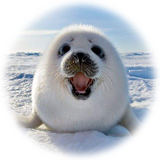

## About Me

Hi, I'm Tianyang Shi (石天阳). I got my B.S. and M.S. degree from <a href="https://www.buaa.edu.cn">BUAA</a> in 2016 and 2019. My research interests focus on computer vision applications in remote sensing, artistic creation and video games. (<a href="https://scholar.google.com/citations?user=oPej400AAAAJ&hl=en">Google Scholar Profile</a>)

I'm currently an AI researcher and working on the problem of game character auto-creation, where we aim to generate game characters based on user-uploaded facial photos. I'm very honer to present the first solution in this topic (<a href="https://arxiv.org/abs/1909.01064">Face-to-Parameter paper</a>), and this technique has been widely used in many popular computer games (including Justice Online, Heaven mobile, Naraka:Bladepoint, etc.).

 

**Contact Me:**

+ Personal Email: shitianyang94@gmail.com

**My News:**

+ NEW (08/2021): I will be serving as a Program Committee (PC) member in CVPR 2022.

+ NEW (07/2021): One paper accepted to ICCV 2021 on the topic of multi-view 3D reconstruction via transformer.

+ NEW (04/2021): One paper accepted to IJCAI 2021 on the topic of in-game choreography.

+ NEW (04/2021): Our character auto-creation method is launched on the new game "Naraka:Bladepoint"！

+ NEW (03/2021): Our new project ["Motion Completion Transformer"](https://arxiv.org/abs/2103.00776) is presented!

+ NEW (03/2021): One paper ("Stylized Neural Painting") accepted to CVPR 2021 as an oral paper. Cheers!

+ NEW (01/2021): One paper accepted to IEEE Transactions on Image Processing.

+ NEW (11/2020): My co-authored work ["Stylized Neural Painting"](https://jiupinjia.github.io/neuralpainter/) with Dr. Zou has been released. Also congratulations to his another excellent work ["SkyAR"](https://jiupinjia.github.io/skyar/). Nice cooperations!

+ NEW (09/2020): Our neural rendering paper was accepted by TPAMI. This is the first work on the topic of game character auto-creation. Excellent cooperation with [Dr. Zhengxia Zou](http://www-personal.umich.edu/~zzhengxi/#Honors).

## Academic

**Publications**

+ **\[IJCAI2021\]** Yinglin Duan\*, Tianyang Shi\* (\*equal contribution), Zhipeng Hu, Zhengxia Zou, et al. Automatic Translation of Music-to-Dance for In-Game Characters. IJCAI 2021. [[PDF](https://www.ijcai.org/proceedings/2021/0323.pdf)] 

+ Yinglin Duan\*, Tianyang Shi\*, Zhengxia Zou\* (\*equal contribution), Yenan Lin, Zhehui Qian, Bohan Zhang, and Yi Yuan. Single-Shot Motion Completion with Transformer. CoRR, abs/2103.00776, 2021. [[PDF](https://arxiv.org/abs/2103.00776)][[Project](https://github.com/FuxiCV/SSMCT)]

+ **\[CVPR2021 ORAL\]** Zhengxia Zou, Tianyang Shi, Shuang Qiu, Yi Yuan, and Zhenwei Shi. Stylized Neural Painting. CoRR, abs/2011.08114, 2020. [[PDF](https://arxiv.org/pdf/2011.08114.pdf)]

+ **\[TIP\]** Zhengxia Zou, Tianyang Shi, Zhenwei Shi, and Jieping Ye. Adversarial Training for Solving Inverse Problems in Image Processing. IEEE Transactions on Image Processing, 2021, in press. [[PDF](http://www-personal.umich.edu/~zzhengxi/zzx_PDF/inverseGANs.pdf)]

+ Zhengxia Zou, Tianyang Shi, Yi Yuan, and Zhenwei Shi. NeuralMagicEye: Learning to See and Understand the Scene Behind an Autostereogram. CoRR, abs/2012.15692, 2020. [[PDF](https://arxiv.org/abs/2012.15692)]

+ **\[TPAMI\]** Tianyang Shi\*, Zhengxia Zou\* (\*equal contribution), Zhenwei Shi, and Yi Yuan. Neural Rendering for Game Character Auto-creation. Transactions on Pattern Analysis and Machine Intelligence, 2020, in press. [[PDF](https://ieeexplore.ieee.org/stamp/stamp.jsp?tp=&arnumber=9197693)]

+ **\[CVPR2020\]** Zhengxia Zou, Sen Lei, Tianyang Shi, Zhenwei Shi, and Jieping Ye. Deep Adversarial Decomposition: A Unified Framework for Separating Superimposed Images. IEEE Conference on Computer Vision and Pattern Recognition (CVPR) 2020. [[PDF](http://www-personal.umich.edu/~zzhengxi/zzx_PDF/CVPR2020.pdf)] [[1min-DemoVideo](http://www-personal.umich.edu/~zzhengxi/zzx_gallery/5946-1min.mp4)] [[Github](https://github.com/jiupinjia/Deep-adversarial-decomposition)]

+ **\[ACMMM2020\]** Tianyang Shi, Zhengxia Zou, Xinhui Song, Zheng Song, Changjian Gu, Changjie Fan, and Yi Yuan. Neutral Face Game Character Auto-Creation via PokerFace-GAN. ACM International Conference on Multimedia (ACM MM) 2020. [[PDF](https://arxiv.org/pdf/2008.07154.pdf)] [[Poster](pokerfacegan-ACMMM2020.png)]

+ **\[ACMMM2020\]** Xinhui Song, Tianyang Shi, Zunlei Feng, Mingli Song, Jackie Lin, Chuanjie Lin, Changjie Fan, and Yi Yuan. Unsupervised Learning Facial Parameter Regressor for Action Unit Intensity Estimation via Differentiable Renderer. ACM International Conference on Multimedia (ACM MM) 2020. [[PDF](https://arxiv.org/pdf/2008.08862.pdf)]

+ **\[RS\]** Zhengxia Zou\*, Tianyang Shi\* (\*equal contribution), Wenyuan Li, Zhou Zhang, and Zhenwei Shi. Do Game Data Generalize Well for Remote Sensing Image Segmentation? Remote Sensing, in press, 2020. [[PDF](https://www.mdpi.com/2072-4292/12/2/275)]

+ **\[AAAI2020\]** Tianyang Shi, Zhengxia Zou, Yi Yuan, and Changjie Fan. Fast and Robust Face-to-Parameter Translation for Game Character Auto-creation. AAAI Conference on Artificial Intelligence (AAAI) 2020. [[PDF](https://www.aaai.org/Papers/AAAI/2020GB/AAAI-ShiT.147.pdf)] [[Poster](frf2p-AAAI2020.png)]

+ **\[ICCV2019\]** Zhengxia Zou, Wenyuan Li, Tianyang Shi, Zhenwei Shi, and Jieping Ye. Generative Adversarial Training for Weakly Supervised Cloud Matting. IEEE International Conference on Computer Vision (ICCV) 2019. [[PDF](http://openaccess.thecvf.com/content_ICCV_2019/html/Zou_Generative_Adversarial_Training_for_Weakly_Supervised_Cloud_Matting_ICCV_2019_paper.html)] [[Github](https://github.com/jiupinjia/CloudMattingGAN)]

+ **\[ICCV2019\]** Tianyang Shi, Yi Yuan, Changjie Fan, Zhengxia Zou, Zhenwei Shi, and Yong Liu. Face-to-Parameter Translation for Game Character Auto-Creation. IEEE International Conference on Computer Vision (ICCV) 2019. [[PDF](https://arxiv.org/abs/1909.01064)] [[Poster](f2p-ICCV2019.png)]

+ **\[RS\]** Tianyang Shi, Qizhi Xu, Zhengxia Zou, and Zhenwei Shi. Automatic raft labeling for remote sensing images via dual-scale homogeneous convolutional neural network. Remote Sensing 10, no. 7 (2018): 1130. [[PDF](https://www.mdpi.com/2072-4292/10/7/1130)]

+ **\[TGRS\]** Zhenwei Shi, Tianyang Shi, Min Zhou, and Xia Xu. Collaborative sparse hyperspectral unmixing using l0 norm. IEEE Transactions on Geoscience and Remote Sensing 56, no. 9 (2018): 5495-5508. [[PDF](https://ieeexplore.ieee.org/abstract/document/8340224)]

[\>\>\> Visit my google scholar for full publication list \<\<\<](https://scholar.google.com/citations?user=oPej400AAAAJ&hl=en)

**Peer-Review Services**

+ AAAI 2021 PC Member; CVPR 2020, 2021, 2022 PC Member; ICCV 2021 PC Member; WACV 2021, 2022 PC Member.

## Talk

+ Tianyang Shi. Face-to-Parameter Translation via Neural Network Renderer. GDC 2020. [[video](https://www.youtube.com/watch?v=OhV_DNji_0U)] (Great pleasure!)

## Awards

+ (10/2020): First Netease Technical Marathon (20,000 CNY), Champion team, Cheers!

+ (10/2020): "Best Technology Innovation Award" for "Game Character Auto-Creation" in the 2020 NetEase Technology Awards Ceremony (50,000 CNY, Team Award). Cheers!
